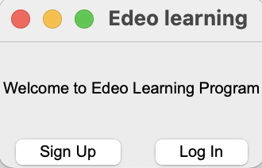
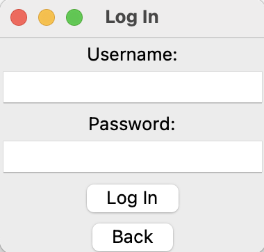
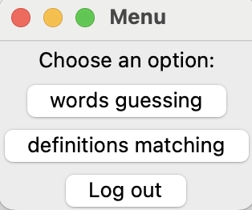
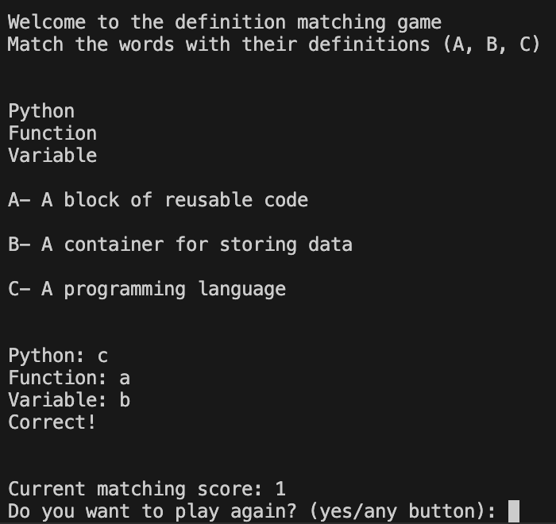
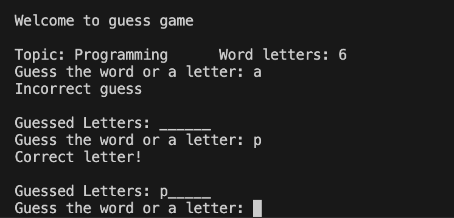
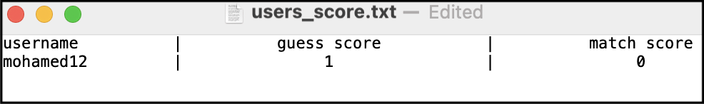
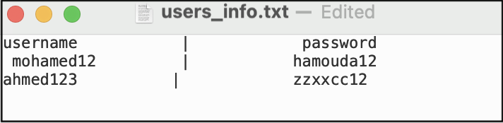

# 📚 About This Project

This project was originally developed as part of a university assignment at the University of the West of England (UWE) 🏫 and is now shared as part of my personal portfolio and resume.

🛠️ It's here to showcase my work and to help others learn — you're welcome to explore the structure, coding style, and problem-solving approach for educational purposes.

🚫 Please don’t copy or submit it as your own — that would go against academic integrity policies and could be considered plagiarism.

👍 Feel free to use it for inspiration, learn from it, and use what you learn to build something even better!

<br>

# 🎯 Word Guess & Match  

A fun and educational Python game that tests vocabulary skills through **word guessing** and **definition matching** challenges.

📝 Note: This project is continuously being updated.
Originally a console-based assignment, GUI features were added for extra credit.
The current window size is not ideal and may affect user experience, but it can be easily adjusted if needed. 🙂

---

# Features 🎯

* 🕹️ **Word Guessing Game**  
  Guess letters or the full word using helpful hints to challenge your vocabulary skills.

* 🔗 **Definition Matching**  
  Connect words with their accurate definitions to boost your understanding.

* 👥 **User Accounts**  
  Create an account, log in, and track your game progress. User data is securely saved with hashed passwords.

* 📊 **Scoring System**  
  Earn points and level up as you play. Scores are saved persistently in text files so your achievements are never lost.

# ⚠️ Limitations & Security Notes

* 🔐 **Password Security**  
  All passwords are stored in hashed form to keep your information safe and private.

* 🖥️ **Optimized Window Size**  
  The app runs in a window sized for the best experience on different screen types.

---

# Data Source 📚

The word lists and definitions used in this game come from the local CSV file located at **[Data source](/src/CSWords.csv)**  🗂️. This file provides a rich, reliable vocabulary dataset that powers the gameplay. Please keep the CSV format consistent when updating or replacing the file to ensure smooth operation ⚡️🔄.

---


# 📸 Screenshots

### 👋 Welcome Page


### 🏠 Login Page


### 👤 User Options Page


### 📚 Definition Match in Terminal


### 🔤 Word Guess in Terminal
 

 ### User Rewards System in txt file
  

 ### Login Credentials in txt file
  

 

---

## 🚀 How to Run  
1. **🧰 Make sure you have Python installed** (Python 3.6+ recommended).
   
2. **🔄 Clone this repository:**
```bash
https://github.com/MohamedHamouda23/Word-games
```

3. **▶️ Run the program**:

```bash
  python3 src/main.py
```

<br>

## 📚 References & Documentation

For full technical insights, issues addressed, evaluation, and testing process, please refer to the following documents located in the [doc folder](docs) directory:

- 📄 [Technical Overview](docs/Technical%20Overview.pdf)  
- 🐞 [Issues and Fixes](docs/Issues%20and%20Fixes.pdf)  
- 🧪 [Testing Process](docs/Testing%20process.pdf)  
- 📊 [Evaluation](docs//Evaluation.pdf)  
- 🔗 [References](docs//References.pdf)  
- 🔁 [Flowchart](docs/Flowchart.pdf)  

